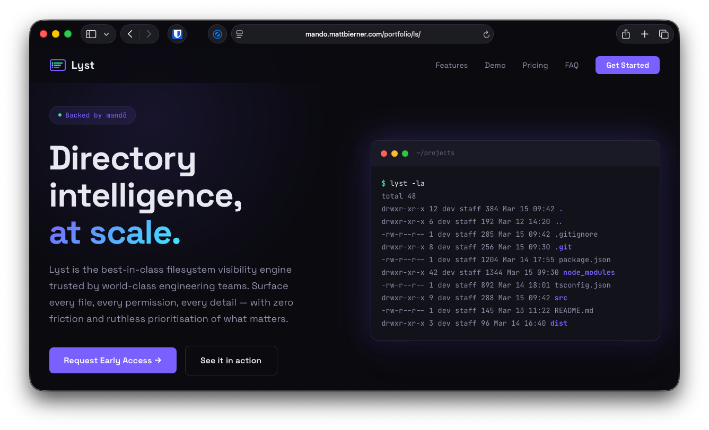
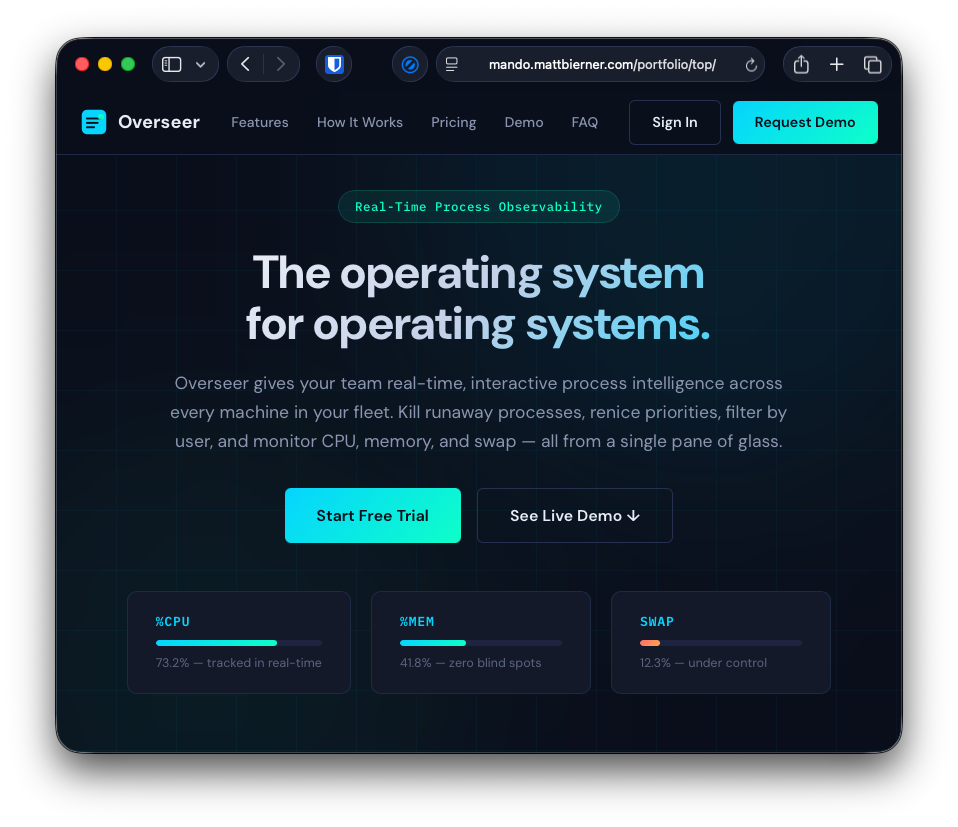
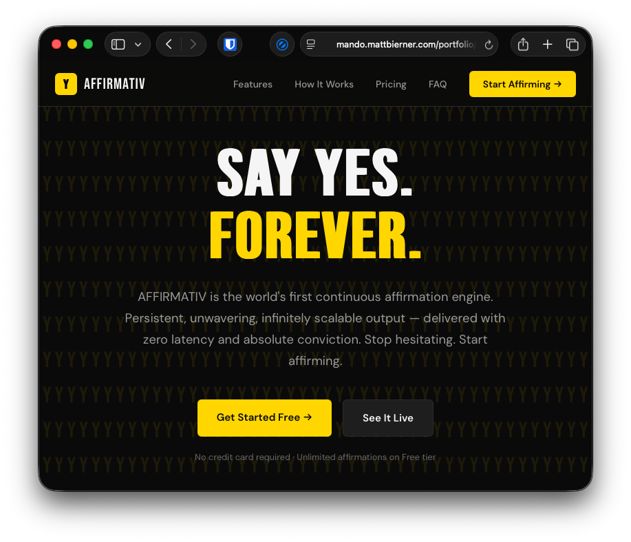
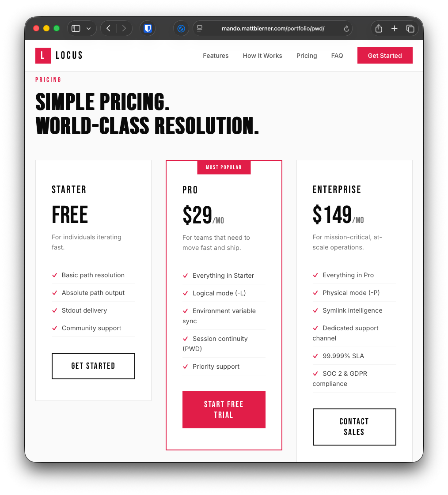

**Links**
- [mandō](https://mando.mattbierner.com/)

Man, I thought to myself looking over the `ls` [man page](https://en.wikipedia.org/wiki/Man_page), this experience sure feels dated. Where are the scroll-driven animations, the testimonials by influencers, the statistics and stats? And what, they're just giving these commands away for free? What kind of sense does that make?!?

But I didn't just see failure, I also saw opportunity! I saw that these crusty old unix commands had real potential, all they needed was someone with the vision to productize, hype, and sell them. That someone was me.

So I fired up the ol' prompter and started building a new company to productize the `ls` command. It was hard work, but after slogging through the initial prompt, I sat back and watched the AI come up with my company's name, build its website, and put together a monetization strategy. Watching my company come to life, I couldn't help but daydream about the posts I would post once I launched: "Everyone overlooked this old code for 50 years. I turned it into $10M ARR in 60 days", or maybe "How I accidentally bootstrapped my way to 500k MRR by never learning what a directory is".

Soon enough, it was done! My head swelled with pride as I reviewed [Lyst's flashy new site](https://mando.mattbierner.com/portfolio/ls/). So much better! 

Now, at this point, a lesser entrepreneur would have been content with starting one measly little company. However, for me, this was just the beginning. With the power of AI, I knew I could be a 100x entrepreneur! So next, I kicked off prompts to build 99 more amazing companies, each around a single unix command, from `alias` to `zip`. 

And to link this incredible portfolio of one hundred companies together, I prompted mandō into existence. [mandō]() is an accelerator running purely on vibes and with a conviction for commercializing the foundational infrastructure of computing. Amazing. The world needs more visionaries like that.

The first thing you'll notice when visiting a mandō company is how early-2020s and familiar their websites all feel. This is because I instructed the AI to extensively study all the best vibe-coded software startups. Turns out all these companies' websites more or less look the same, so the AI was able to do a great job making sure mandō's portfolio of companies blends right in.

Second, you'll see that I've greatly improved the marketing. No more nerdy names like `chown` or `wc`. No, now it's [CLAIMR](https://mando.mattbierner.com/portfolio/chown/) and [Census](https://mando.mattbierner.com/portfolio/wc/). I've also massively improved their pitches. Consider how the `ls` command's man page used to start:

> ls – list directory contents

Ugh, boring! You try pitching that to a CTO and they would call you a nerd and pull your underwear clear up over your head.

Contrast this with [my much-improved hook](https://mando.mattbierner.com/portfolio/ls/):

> Lyst is the best-in-class filesystem visibility engine trusted by world-class engineering teams. Surface every file, every permission, every detail — with zero friction and ruthless prioritisation of what matters.

Best in class! World Class! Every file! Zero friction! And is your current file system visibility engine ruthless? Ha, no, I didn't think so.

I've made similar improvements throughout each company's marketing. Every flag, every operation now has a trademarked name and punchy statement selling it as skillfully as a LinkedIn entrepreneur.

These companies are really more than just products, too. They have missions, statements, and manifestos. Consider this one from [Portage](https://mando.mattbierner.com/portfolio/mv/) (mv):

> "For decades, the act of moving a file has been treated as an afterthought — a blunt operation buried in documentation nobody reads. We founded Portage because we believe relocation is a creative act. Every rename is a rebirth. Every move across filesystems is a migration story. When you choose where something lives, you are making a statement about your values, your architecture, and your taste. We built Portage for people who understand that the journey matters as much as the destination."
> — The Portage Founders

Wow, now *that's* someone I'd trust to move my data.

Lastly, the old pricing structure of these unix commands was extremely confusing and out of step with the modern tech ecosystem. So with the help of AI, I developed a set of familiar subscription-based pricing tiers. There's always a free tier, of course, to give users a little taste, with options to upgrade to pro or even enterprise. Nice!

With this improved pricing for my 100 companies, it should be a breeze to reach the mythical one-man, one-billion-dollar corporate milestone. Hard to believe no one except me was smart enough to see this before.

Yes, I foresee great things for mandō. Its conviction let it identify a market opportunity that had long been overlooked. Plus we've already got a stable of 100 amazing companies out there hustling.

If you'd like to invest in mandō's vision or think you have what it takes to help capitalize the foundational layer of computing, you can learn more at [http://127.0.0.1:8080/](https://mando.mattbierner.com)

